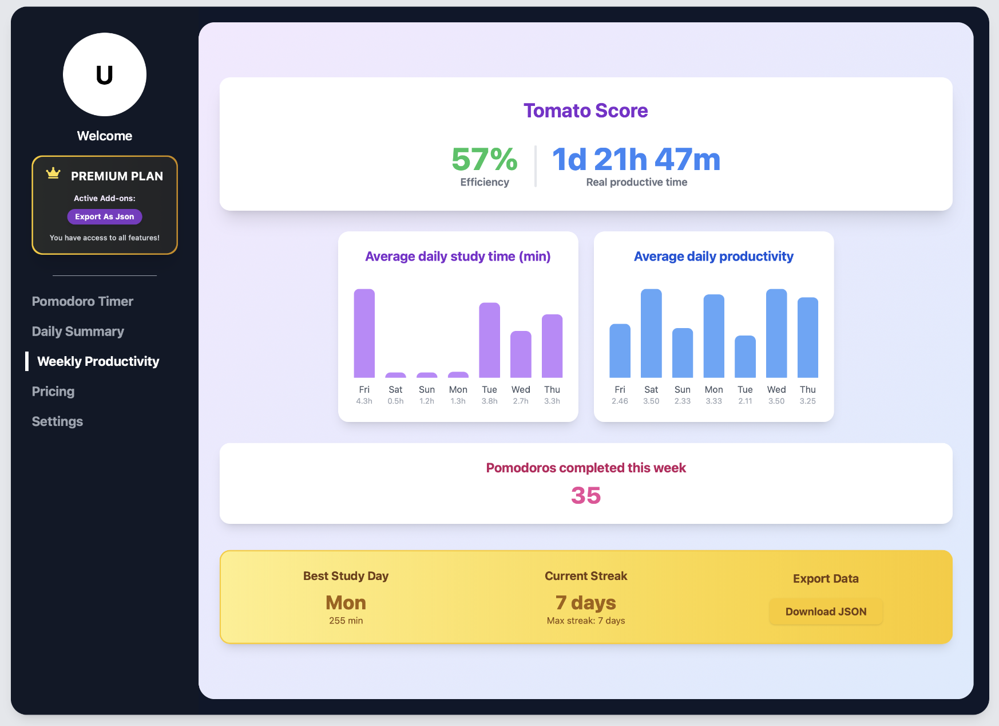

# TomatoMeter



## Table of Contents

1. [Introduction](#introduction)
2. [Live Demo with Docker](#live-demo-with-docker)
3. [About the Demo Application & Pricing](#about-the-demo-application--pricing)
4. [Project Structure](#project-structure)
5. [Tech Stack](#tech-stack)
6. [Pricing4SaaS Load Testing](#pricing4saas-load-testing)
7. [Disclaimer & License](#disclaimer--license)

---

## Introduction

Welcome to **TomatoMeter**!  

This repository presents a demo Pomodoro timer application that integrates with [SPACE](https://github.com/Alex-GF/space) as its pricing-driven self-adaptation engine, enabling dynamic behavior based on variability induced by its pricing model. It is designed to test and showcase the functionality and capabilities of SPACE in a practical setting.

Developed by the [ISA-Group](https://github.com/isa-group), this project is part of ongoing research into pricing-driven development and operation.

## Live Demo with Docker

You can launch the entire demo locally using Docker.

**Requirements:**  

- [Docker](https://www.docker.com/get-started) installed on your machine.

### Run a SPACE instance

Before running the demo, you need to have a SPACE instance running. You can do this by following these steps:

1. Clone the repository, navigate to its folder and run SPACE using docker compose:

```bash
git clone https://github.com/Alex-GF/space.git
cd space
docker compose up -d
```

Then wait for the SPACE instance to start. If everything is set up correctly, your space instance should be running at [http://localhost:5403](http://localhost:5403).

If you want to explore SPACE, you can log in into the app using the following default credentials:

- **Username:** `admin`
- **Password:** `space4all`

> [!NOTE]
> If you are interested in learning more about SPACE, you can check out the [SPACE documentation](https://github.com/Alex-GF/space#readme) for more details on how to set it up, configure it, and use its features.

### Run TomatoMeter (demo application)

Now that you have a SPACE instance running, you can launch the TomatoMeter demo application.

1. Clone the repository

```bash
git clone https://github.com/Alex-GF/space-demo.git
cd space-demo
```

2. Generate a `.env` file that sets the both the domain where SPACE is hosted and the API Key that will be used by the demo application to connect to SPACE. This file is **required** for the demo to work properly.

> [!TIP]
> For quiker setup, you can run the following command to create a `.env` file with the necessary configuration. This will run a script that rerieves the API key of an admin user from the SPACE instance you started earlier (considering that you used the configuration provided in this tutorial to do so).

```bash
chmod +x scripts/retrieve-space-api-key.sh
./scripts/retrieve-space-api-key.sh
```

3. Run TomatoMeter using Docker Compose:

```bash
cd docker
docker compose up -d
```

Wait for the space-demo-nginx instance to start. If everything is set up correctly, the TomatoMeter SPACE demo should be running at [http://localhost](http://localhost).

## About TomatoMeter and its Pricing

TomatoMeter is a productivity management app based in the pomodoro technique. It allows users to track their work sessions, evaluate their productivity, and review insights about their performance. 

### Pricing

Since TomatoMeter has been designed to demonstrate the capabilities of SPACE in managing variability introduced by pricing models, it includes a pricing model with 3 different plans: FREE, ADVANCED, and PREMIUM; along with 2 add-ons.

**Key features include:**

- **Pomodoro Timer:** A simple and effective timer to manage work sessions based on the Pomodoro Technique. The pricing also impose an **usage limit** to this feature that restricts the maximum amount of pomodoro timers that can be initiated each day.
- **Sound Notifications:** Emit sound notifications to signal the end of pomodoros.
- **Basic analytics:** number of pomodoros completed pomodoros, total time worked and productivity score.
- **Motivational Quotes:** Display motivational quotes above the timer to keep users inspired.
- **Daily summary:** Overview of completed pomodoros by day over the last month.
- **Dark Mode:** A dark mode option for a better user experience in low-light environments.
- **Custom Pomodoro Duration:** Users can customize the duration of their pomodoros and breaks.
- **Advanced analytics:** productivity trends, pomodoro streaks, and more
- **Export Data as JSON:** Ability to export pomodoro data in JSON format for further analysis or backup.

The pricing page (see image below) showcases how different features must be enabled or disabled regarding the selected subscription (i.e. the selected plan and, optionally, complementary contracted add-ons).


### Purpose of the Demo

Since, as mentioned before, this demo aims to demonstrate the capabilities of SPACE in managing variability introduced by pricing models, you'll find a button behind the TomatoMeter's screen that triggers a **pricing change event.** In short, this event will perform the following changes to the pricing:

- **Change the availability of the basic analytics feature:** In this new version, only users from ADVANCED and PREMIUM plans will be able to access this feature.
- **Further restricts the amount of daily pomodoro timers for BASIC users:** These will only be able to initiate **1 pomodoro timers per day**.

By clicking the button again, you can revert these changes and return to the original pricing model.

## Project Structure

The repository is organized as follows:

```
.
├── api/                # Backend (Express, TypeScript)
│   ├── config/         # Configuration files
│   ├── middlewares/    # Express middlewares
│   ├── resources/      # API resources (YAML, etc.)
│   ├── routes/         # API routes
│   └── utils/          # Backend utilities
├── src/                # Frontend (React, Vite, TypeScript)
│   ├── apps/           # App entry points
│   ├── components/     # Reusable UI components
│   ├── contexts/       # React context providers
│   ├── data/           # Static data (JSON)
│   ├── lib/            # Frontend libraries/utilities
│   ├── pages/          # Page components
│   └── static/         # Static assets (CSS, sounds)
├── docker/             # Docker and Docker Compose files
├── nginx/              # Nginx configuration (if used)
├── images/             # Project screenshots and images
├── tsconfig.json       # TypeScript configuration
├── package.json        # Project metadata and scripts
└── README.md           # This file
```

---

## Tech Stack

<div align="center">

| Frontend         | Backend         | Tooling & DevOps      | Other                |
|------------------|----------------|-----------------------|----------------------|
|  |  |  |  |
|  |  |  |  |
|  |  |  |  |

</div>

---

## Load Testing

If you want to replicate the results presented in the paper presenting SPACE (submitted to ICSOC'25), you must follow these steps:

### 1. Configure the project for load testing

This demo project rely on [artillery](https://www.artillery.io) to develop, run and evaluate load tests. Therefore, in order to ensure a seamless integration between Tomatometer and artillery.io (the service where artillery insights are stored), you must follow these steps:

1. Install the dependencies of the project:

    ```bash
    pnpm install
    # or
    npm install
    # or
    yarn install
    ```

2. Connect to [artillery.io](https://www.artillery.io) using your github account and generate an API key. Once logged, you can find your API key in `settings -> API Keys`.

3. Generate a `.env` file following the structure of `.env.example`. Considering that you already have your artilleri.io API key, your `.env` file should look like this:

    ```bash
    ARTILLERY_KEY=a9_koizwzxadtywh677t9hwg9pvogmr600f # The artillery API key
    ```

### 2. Run the load tests

After configuring the project, you can either run all tests at once, or run them individually.

- **To run all tests at once**, just run on the root folder:

```bash
pnpm run load-test
```

- **To run individual tests**, you can use the commands with the `load-test` prefix in the `package.json` file. For example, to run the `renew-only` test, you can run:

```bash
pnpm run load-test:renew-only
```

## Disclaimer & License

> **License:**  
> This project is licensed under the MIT License. See the [LICENSE](LICENSE) file for details.

> **Disclaimer:**  
> This repository is developed and maintained in a controlled research environment by the [ISA-Group](https://isa-group.es) to demonstrate advances pricing-driven self adaptation solutions.  
> The ISA-Group is not responsible for any issues, damages, or consequences that may arise if this software is used in other projects or production environments.  
> Use at your own risk.

If you have any questions or want to contribute, feel free to open an issue or contact the maintainers.