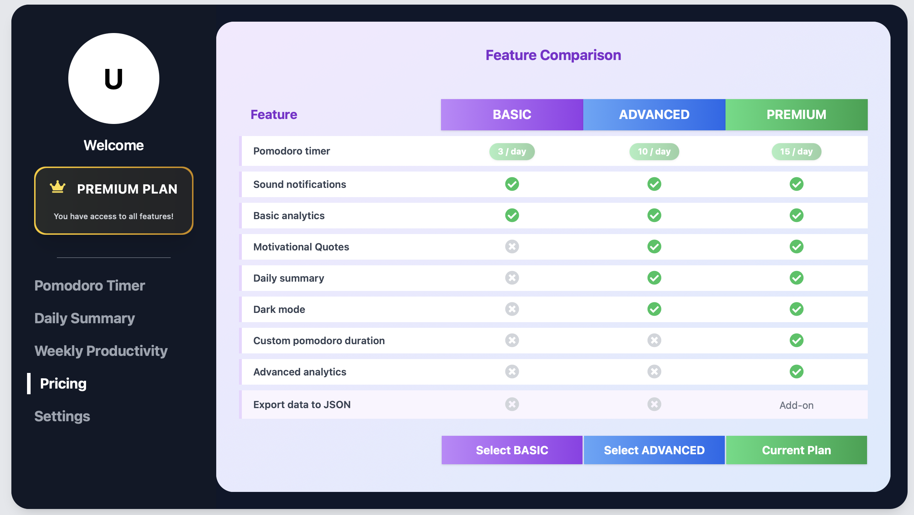

# Pricing-driven feature toggling demo

This is a demo app aimed to showcase sample implementations of tools to manage pricing-driven feature toggling.

## How to run the project

We have not dockerized the project yet, so you will need to run it locally. To do so:

1. Clone the repository

```bash
git clone https://github.com/Alex-GF/pricing-driven-feature-flags-demo.git
```

2. Go to the demo folder

```bash
cd pricing-driven-feature-flags-demo/demo
```

3. Install the dependencies

```bash
npm install
```

4. Run the project

```bash
npm run dev
```

5. If everything has gone well, this should be the output of your terminal:

```bash
[1] [0]   VITE v5.4.11  ready in 101 ms
[1] [0] 
[1] [0]   ➜  Local:   http://localhost:5173/
[1] [0]   ➜  Network: use --host to expose
[1] [1] 
[1] [1] Rebuilding...
[0] Server is running on http://localhost:3000
[1] [1] 
[1] [1] Done in 2109ms.
```

6. Open your browser and go to `http://localhost:5173/` to see the demo app.

## How does the demo work?

The demo app is a simple expenses management system that allows you to add new expenses to your list in order to keep track of them. The app has three main features:

1. **Add new expense**: You can add a new expense to your list by clicking on the "Add new expense" button.

2. **Expense Categorization**: Once an expense is created, a category is automatically assigned to it.

3. **Expenses graph**: The app shows a graph of your expenses, grouped by month.

To regulate the access to such features, the demo is driven by a simple 2-plan-based pricing model:



- **Basic Plan**: This plan is free and allows you to use the app without the graph feature, and limits the number of expenses you can add to 5.

- **Premium Plan**: This plan costs $5 per month and allows you to use the app with all its features and a limit of 100000 expenses. Enough for personal users.

To change the plan in the demo, you can click on the "Active Plan" button:

